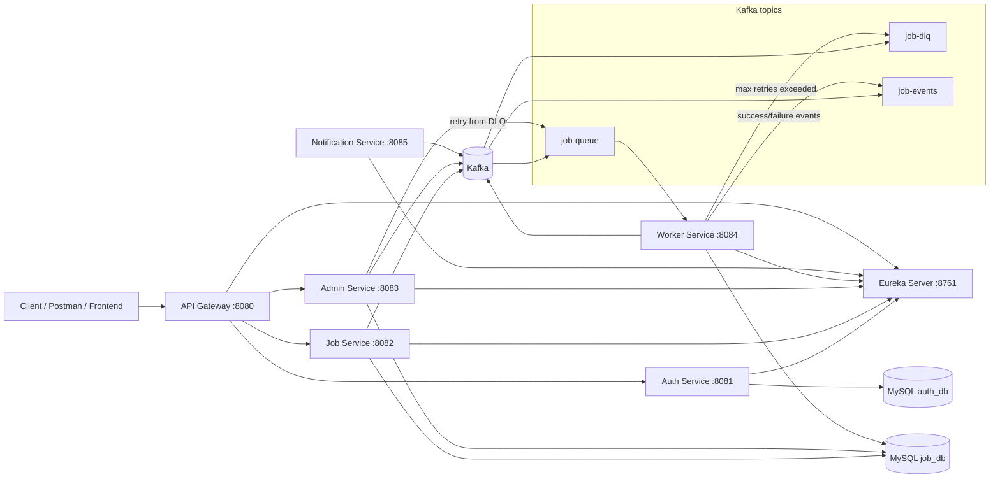

# Distributed Job Scheduling Platform

A Spring Boot microservices platform for submitting, processing, monitoring, and retrying jobs with Kafka-backed asynchronous execution, service discovery, and an API gateway.

## Features

- JWT Authentication
- API Gateway with Eureka-based routing
- Asynchronous job processing using Kafka
- Exponential retry mechanism
- Dead Letter Queue (DLQ)
- Idempotent worker execution
- Admin dashboard APIs
- Notification event pipeline
- Docker Compose deployment

## Architecture diagram



## Tech stack

- **Java 21**
- **Spring Boot 3.5.x**
- **Spring Web / Spring Web MVC**
- **Spring Cloud Gateway MVC**
- **Spring Cloud Netflix Eureka**
- **Spring Data JPA**
- **Spring Security**
- **Spring Kafka**
- **MySQL 8**
- **Apache Kafka**
- **Lombok**
- **Maven**
- **Docker / Docker Compose**

## Engineering patterns

### At-least-once processing
- Jobs are consumed from Kafka with **manual acknowledgement** in `worker-service`.
- The consumer only acknowledges after the job is fully processed and status is persisted.
- If processing fails before acknowledgement, Kafka can redeliver the message.

### Exponential backoff
- Retry delay is implemented in `worker-service` using an exponential backoff strategy:
    - attempt 0 → 1s
    - attempt 1 → 2s
    - attempt 2 → 4s
- The current implementation uses `Thread.sleep(...)` inside the worker flow, so it is simple but blocks the thread.

### Dead Letter Queue (DLQ)
- When retries exceed the maximum attempt count, the worker republishes the job to `job-dlq`.
- The admin service can inspect DLQ jobs and republish them back to `job-queue`.

### Idempotency
- The worker checks whether a job is already marked `COMPLETED` before processing.
- This helps prevent duplicate side effects if Kafka redelivers a message.
- The database job status acts as the source of truth for processing state.

## Services breakdown

### 1) `eureka-server`
- Service registry for discovery.
- Default port: `8761`

### 2) `api-gateway`
- Single entry point for clients.
- Routes requests to services via Eureka.
- Default port: `8080`
- Routes:
    - `/api/auth/**` → `AUTH-SERVICE`
    - `/api/jobs/**` → `JOB-SERVICE`
    - `/api/admin/**` → `ADMIN-SERVICE`

### 3) `auth-service`
- Registration, login, token validation, and customer lookup.
- Default port: `8081`
- Persists users in `auth_db`.

### 4) `job-service`
- Accepts job submissions and retrieves job data for the authenticated user.
- Publishes job messages to Kafka topic `job-queue`.
- Default port: `8082`
- Persists jobs in `job_db`.

### 5) `worker-service`
- Consumes jobs from Kafka.
- Executes jobs.
- Retries failures with backoff.
- Sends exhausted jobs to `job-dlq`.
- Default port: `8084`

### 6) `admin-service`
- Admin visibility for jobs, DLQ jobs, and stats.
- Can retry jobs from DLQ back to `job-queue`.
- Default port: `8083`

### 7) `notification-service`
- Consumes job events for notifications and audit-style event handling.
- Default port: `8085`

## API endpoints

All client requests should go through the API Gateway unless you are testing a service directly.

### Auth service
- `POST /api/auth/register`
- `POST /api/auth/login`
- `GET /api/auth/validate`
- `GET /api/auth/cust/{email}`

### Job service
- `POST /api/jobs`
- `GET /api/jobs`
- `GET /api/jobs/{id}`

> The job endpoints require an `Authorization: Bearer <token>` header.

### Admin service
- `GET /api/admin/jobs`
- `GET /api/admin/jobs/status/{status}`
- `GET /api/admin/jobs/dlq`
- `POST /api/admin/jobs/{id}/retry`
- `GET /api/admin/stats`

## How to run locally

### Prerequisites
- Java 21
- Maven 3.9+
- MySQL 8
- Apache Kafka
- Eureka Server

### Option A: run services manually
1. Start MySQL, Kafka, and Eureka.
2. Configure each service’s `application.properties` / `application.yml` for local ports and connection strings.
3. Start each service in this order:
    1. `eureka-server`
    2. `auth-service`
    3. `job-service`
    4. `worker-service`
    5. `admin-service`
    6. `notification-service`
    7. `api-gateway`

Example commands:

```powershell
cd eureka-server; .\mvnw.cmd spring-boot:run
cd auth-service; .\mvnw.cmd spring-boot:run
cd job-service; .\mvnw.cmd spring-boot:run
cd worker-service; .\mvnw.cmd spring-boot:run
cd admin-service; .\mvnw.cmd spring-boot:run
cd notification-service; .\mvnw.cmd spring-boot:run
cd api-gateway; .\mvnw.cmd spring-boot:run
```

### Option B: build first, then run
```powershell
cd auth-service; .\mvnw.cmd clean test
cd job-service; .\mvnw.cmd clean test
cd admin-service; .\mvnw.cmd clean test
cd worker-service; .\mvnw.cmd clean test
cd notification-service; .\mvnw.cmd clean test
cd eureka-server; .\mvnw.cmd clean test
cd api-gateway; .\mvnw.cmd clean test
```

## How to run with Docker

The repository includes `docker-compose.yml` with the full stack:
- Kafka
- `mysql-auth`
- `mysql-jobs`
- Eureka Server
- Auth Service
- Job Service
- Worker Service
- Admin Service
- Notification Service
- API Gateway

### Start everything
```powershell
docker compose up --build
```

### Stop everything
```powershell
docker compose down
```

### Reset data volumes
```powershell
docker compose down -v
```

### Default ports
- API Gateway: `8080`
- Auth Service: `8081`
- Job Service: `8082`
- Admin Service: `8083`
- Worker Service: `8084`
- Notification Service: `8085`
- Eureka Server: `8761`
- Kafka: `9092`
- MySQL auth: `3307`
- MySQL jobs: `3308`

## How to test DLQ flow

### Goal
Verify that a failing job:
1. is retried with backoff,
2. is moved to `job-dlq` after max retries,
3. can be replayed by the admin service.

### Suggested test flow
1. Start the platform.
2. Register and log in through `auth-service`.
3. Submit a job through `job-service` that is known to fail in the worker.
    - Use a payload that your `JobExecutorService` cannot process successfully.
4. Watch the worker logs:
    - first retry attempt
    - second retry attempt
    - third retry attempt
    - then DLQ publish
5. Check admin endpoints:
    - `GET /api/admin/jobs/dlq` to confirm the job moved to DLQ
6. Retry the DLQ job:
    - `POST /api/admin/jobs/{id}/retry`
7. Confirm it returns to `job-queue` and is processed again by the worker.

### What to verify
- Job status changes to `FAILED` during retries.
- Job status changes to `DLQ` when retries are exhausted.
- Retried jobs are republished to `job-queue`.
- Completed jobs are not processed twice because of the idempotency check.

## Author

**Advait Bothe**

If you found this project useful, consider giving it a ⭐ on GitHub.

Built with **Spring Boot • Spring Cloud • Kafka • MySQL • Docker**


